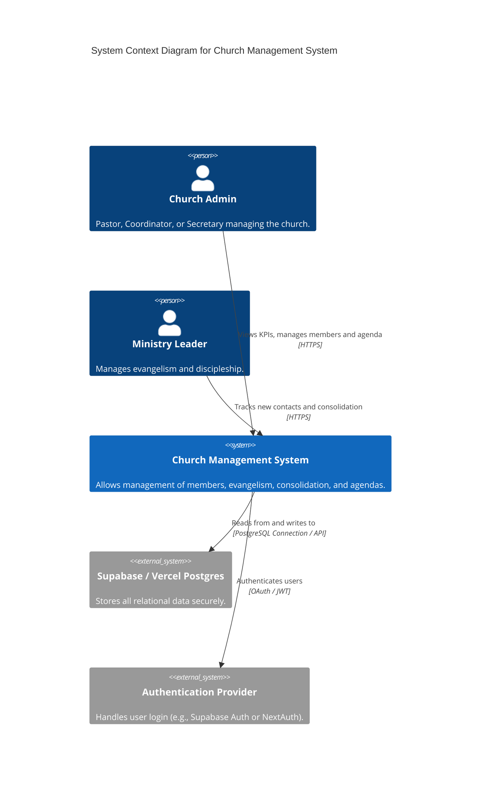

# General Architecture

The **Church Management System (Plan IEBB)** is designed as a Full-Stack Monorepo. This approach minimizes DevOps overhead and keeps both the frontend and backend tightly coupled and easy to maintain.

## C4 Context Diagram

Below is the high-level C4 Context Diagram illustrating how users interact with the system and how the system interacts with external services.

## Core Technologies
- **Hosting / CI-CD**: Vercel
- **Framework**: Next.js (App Router)
- **Database**: PostgreSQL (via Supabase or Vercel Postgres)
- **Styling**: Tailwind CSS or Vanilla CSS Modules
- **State Management**: React Server Components + Client Hooks
