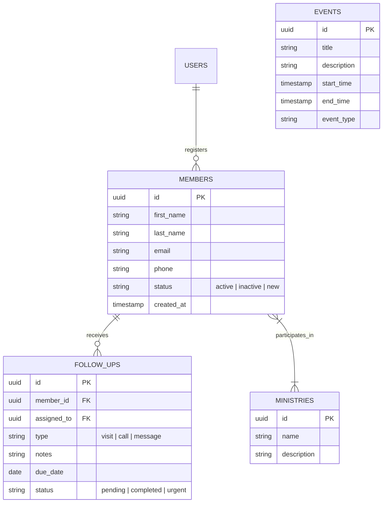

# Backend Architecture

The backend logic is tightly integrated into the Next.js repository using **Server Actions** and **Route Handlers**. The data layer relies on a managed PostgreSQL database.

## Entity-Relationship (ER) Model

This diagram illustrates the core database schema for the MVP.

## API and Data Fetching
- **Server Actions**: We will use Next.js Server Actions for all mutations (e.g., creating a new member, updating follow-up status). This allows us to handle form submissions natively without writing separate API routes.
- **Data Access Layer**: Direct database queries using an ORM like **Prisma** or the **Supabase JS Client** directly from the Server Components.
