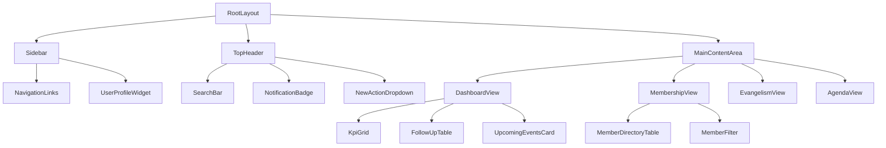

# Frontend Architecture

The frontend is built with **React** via the **Next.js App Router**. The interface visible to the users will be strictly in **Spanish**, while the source code (components, variables, functions) will be in **English**.

## Component Tree

Below is a Mermaid diagram representing the primary React Component structure for the MVP dashboard.

## State Management
- **Server Components (RSC)**: Used by default to fetch data (e.g., fetching the member list) securely on the server without shipping JavaScript to the client.
- **Client Components**: Used only when interactivity is required (e.g., `onClick` handlers for the `NewActionDropdown` or `Sidebar`). Marked with `"use client"`.

## Styling
We will use a modular CSS approach respecting the official color palette:
- `--azul-negro`: `#1b1f3b`
- `--naranja-vivido`: `#e64216`
- `--naranja`: `#ef912e`
- `--rojo`: `#7e1a19`
- `--naranja-pastel`: `#f6c981`
- `--blanco-naturaleza`: `#fefefe`
