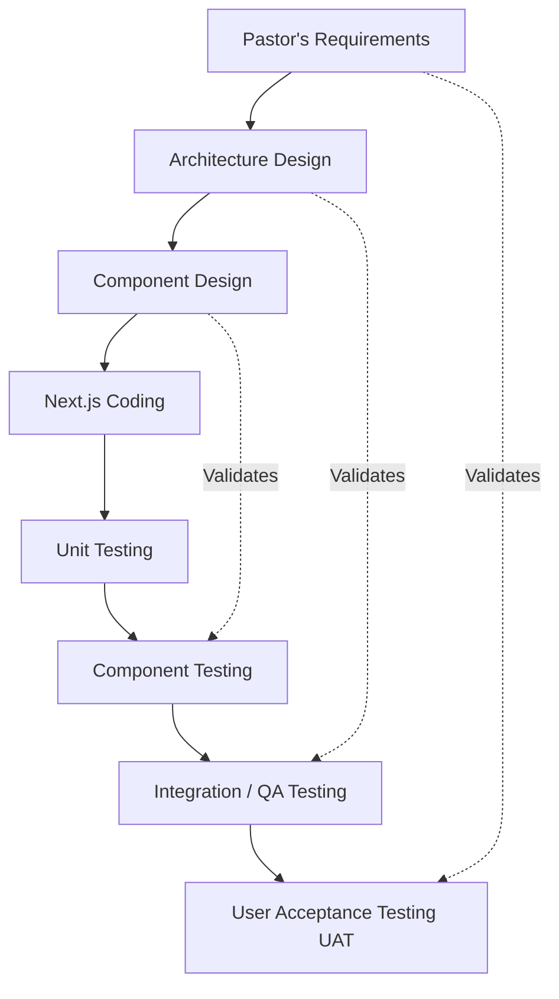

# Testing Strategy (V-Model)

To guarantee the enterprise-grade quality of the **Church Management System**, we will implement our testing strategy based on the **V-Model**. This means that for every design and development phase, there is a corresponding testing phase.

The tests will be divided between automatic executions in **GitHub Actions** and manual/exploratory validations in the **QA** and **Staging** environments.

## V-Model Diagram applied to the CMS

## Testing Phases and Environments

### 1. Unit Testing
- **Goal**: Test isolated functions, mathematical utilities, or business logic (e.g., email validation, date calculation for the Agenda).
- **Tools**: Jest or Vitest.
- **Where does it run?**: Automatically in **GitHub Actions** every time a developer pushes to a development branch or opens a PR.

### 2. Component Testing
- **Goal**: Test that React components (buttons, tables, Dashboard cards) render correctly in isolation and respond to clicks.
- **Tools**: React Testing Library.
- **Where does it run?**: Automatically in **GitHub Actions** alongside unit tests before allowing the "Merge".

### 3. Integration and System Testing (QA)
- **Goal**: Validate that the frontend (React) and backend (Supabase/Server Actions) communicate correctly.
- **Tools**: Automatic End-to-End (E2E) tests with **Cypress** or **Playwright**, and Manual Functional Tests.
- **Where does it run?**: 
  - Automated tests run in GitHub Actions on the PR to `qa`.
  - Manual tests are performed by a human evaluator accessing the temporary URL of the **QA** environment.

### 4. User Acceptance Testing (UAT)
- **Goal**: Validate that the system fulfills exactly what the Pastor or ministry leaders initially requested (Membership, Evangelism).
- **Tools**: Manual business logic tests and Usability tests (UI/UX).
- **Where does it run?**: In the **Staging** branch and environment, which is an exact copy of the production environment, right before the official launch to `main`.

## CI/CD Flow Summary
| Test Type | Environment / Tool | Automatic or Manual? | Blocks Production Release |
| :--- | :--- | :--- | :--- |
| **Unit** | GitHub Actions | Automatic | Yes |
| **Component** | GitHub Actions | Automatic | Yes |
| **Integration E2E** | GitHub Actions / QA | Hybrid | Yes |
| **Acceptance (UAT)** | Staging | Manual | Yes |
