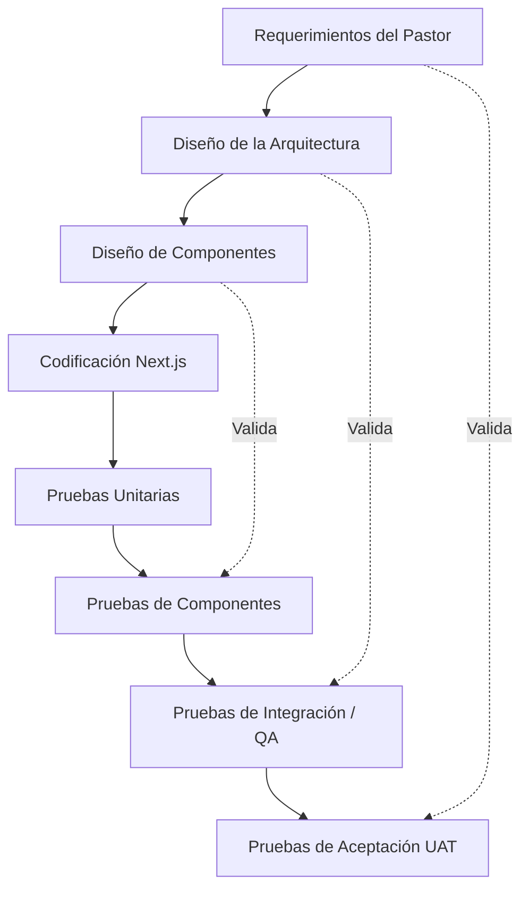

# Estrategia de Pruebas (Modelo en V)

Para garantizar la calidad de nivel empresarial del **Church Management System**, implementaremos nuestra estrategia de pruebas basándonos en el **Modelo en V (V-Model)**. Esto significa que por cada fase de diseño y desarrollo, existe una fase de prueba correspondiente.

Las pruebas estarán divididas entre ejecuciones automáticas en **GitHub Actions** y validaciones manuales/exploratorias en los entornos de **QA** y **Staging**.

## Diagrama del Modelo en V aplicado al CMS

## Fases y Entornos de Prueba

### 1. Pruebas Unitarias (Unit Testing)
- **Objetivo**: Probar funciones aisladas, utilidades matemáticas o lógica de negocio (ej. validación de emails, cálculo de fechas para la Agenda).
- **Herramientas**: Jest o Vitest.
- **¿Dónde se ejecutan?**: Automáticamente en **GitHub Actions** cada vez que un desarrollador hace un `push` a una rama de desarrollo o abre un PR.

### 2. Pruebas de Componentes (Component Testing)
- **Objetivo**: Probar que los componentes de React (botones, tablas, tarjetas del Dashboard) se rendericen correctamente de forma aislada y respondan a clics.
- **Herramientas**: React Testing Library.
- **¿Dónde se ejecutan?**: Automáticamente en **GitHub Actions** junto con las pruebas unitarias antes de permitir el "Merge".

### 3. Pruebas de Integración y Sistema (QA)
- **Objetivo**: Validar que el frontend (React) y el backend (Supabase/Server Actions) se comuniquen correctamente.
- **Herramientas**: Pruebas automáticas End-to-End (E2E) con **Cypress** o **Playwright**, y Pruebas Manuales Funcionales.
- **¿Dónde se ejecutan?**: 
  - Las automáticas en GitHub Actions en el PR hacia `qa`.
  - Las manuales las realiza un evaluador humano ingresando a la URL temporal del entorno de **QA**.

### 4. Pruebas de Aceptación del Usuario (UAT)
- **Objetivo**: Validar que el sistema cumple exactamente con lo que el Pastor o los líderes de ministerio solicitaron inicialmente (Membresía, Evangelismo).
- **Herramientas**: Pruebas manuales de negocio y pruebas de Usabilidad (UI/UX).
- **¿Dónde se ejecutan?**: En la rama y entorno de **Staging**, que es una copia exacta del entorno de producción, justo antes del lanzamiento oficial a `main`.

## Resumen del Flujo CI/CD
| Tipo de Prueba | Entorno / Herramienta | ¿Automático o Manual? | Bloquea el pase a Producción |
| :--- | :--- | :--- | :--- |
| **Unitarias** | GitHub Actions | Automático | Sí |
| **Componentes** | GitHub Actions | Automático | Sí |
| **Integración E2E** | GitHub Actions / QA | Híbrido | Sí |
| **Aceptación (UAT)** | Staging | Manual | Sí |
